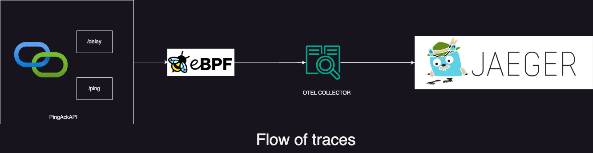

## Distributed Tracing with OTel Collector, and Jaeger

### 1. Overview

Distributed tracing is essential for understanding the flow of requests across microservices in a complex system. In this guide, we'll set up a tracing pipeline using eBPF, the OpenTelemetry Collector (OTel Collector), and Jaeger.

### 2 Flow diagram

### 3. Components

- **PingAckAPI**:
  - Is a light weight `net/http` API
  - Exposes `/ping` and /`delay`
  - Also has Swagger integrated for easy
- **OpenTelemetry Collector**:
  - Collects, processes, and exports telemetry data (including traces).
  - Acts as an intermediary between eBPF and Jaeger.
- **Jaeger**:
  - Distributed tracing system for visualizing and analyzing trace data.

### 3. Access
Access swagger - http://localhost:7997/swagger/index.html
Access jaeger - http://localhost:16686/
